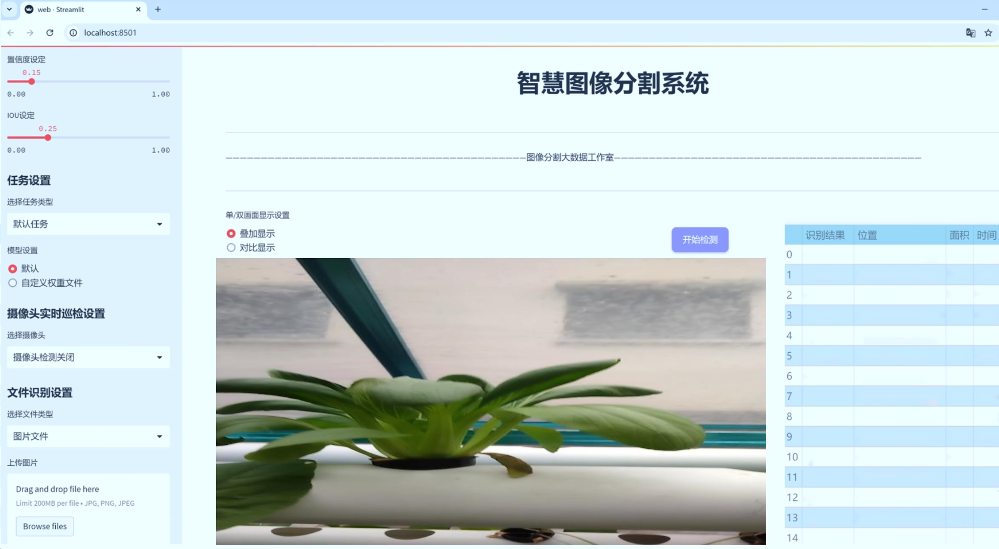
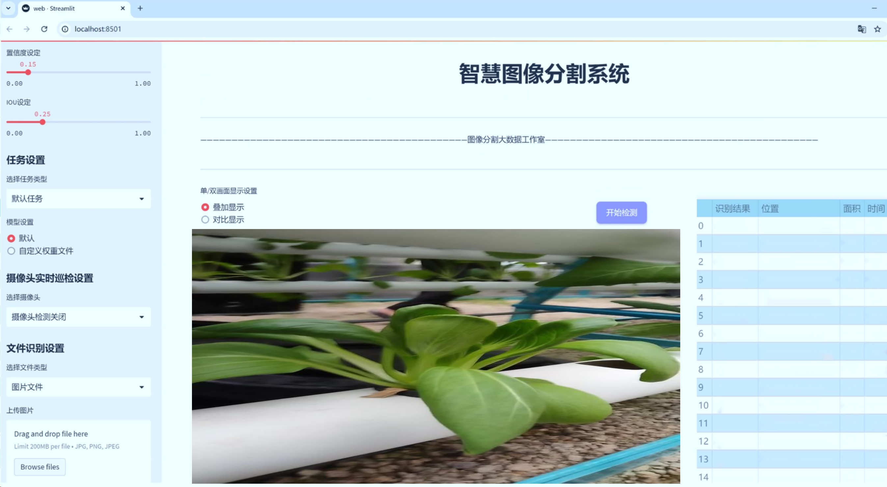
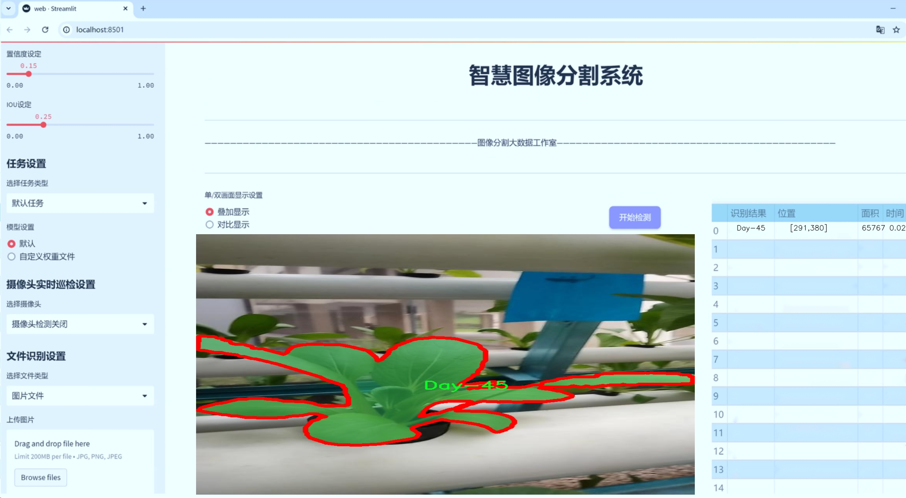
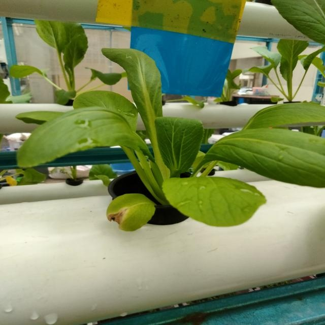
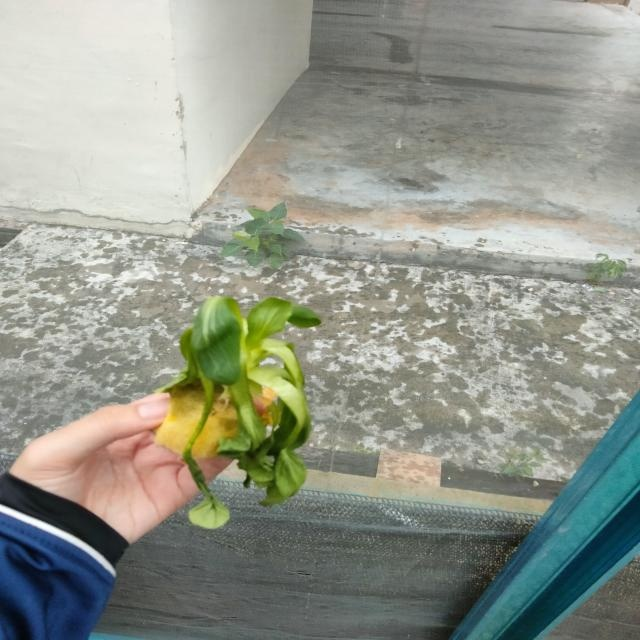
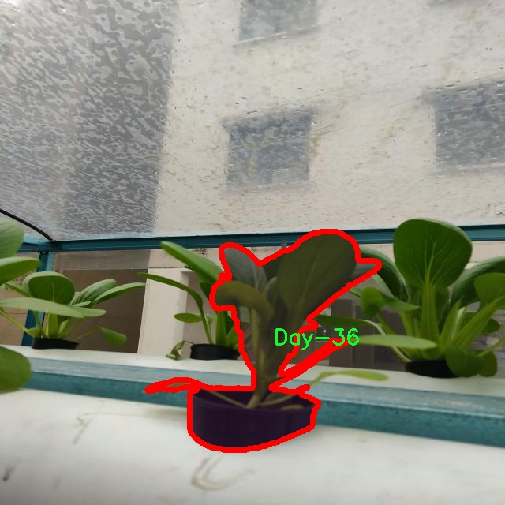
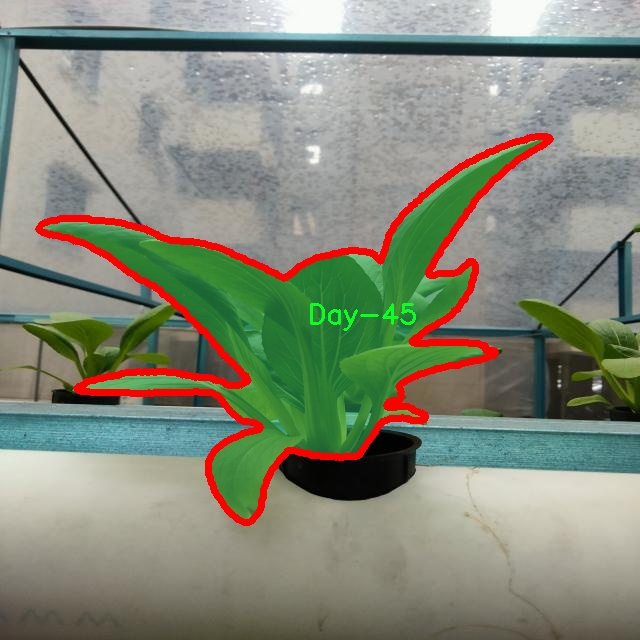
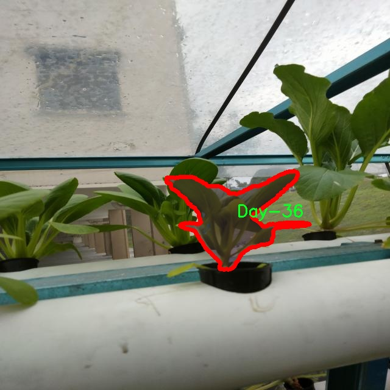

# 蔬菜生长阶段分割系统源码＆数据集分享
 [yolov8-seg-EfficientFormerV2＆yolov8-seg-goldyolo等50+全套改进创新点发刊_一键训练教程_Web前端展示]

### 1.研究背景与意义

项目参考[ILSVRC ImageNet Large Scale Visual Recognition Challenge](https://gitee.com/YOLOv8_YOLOv11_Segmentation_Studio/projects)

项目来源[AAAI Global Al lnnovation Contest](https://kdocs.cn/l/cszuIiCKVNis)

研究背景与意义

随着全球人口的不断增长，农业生产面临着日益严峻的挑战。为了满足日益增加的食品需求，提升农业生产效率和作物产量成为了亟待解决的问题。在此背景下，智能农业的概念逐渐兴起，尤其是计算机视觉技术在农业领域的应用，正在为传统农业带来深刻的变革。蔬菜作为重要的农作物，其生长阶段的监测与管理对提高产量和质量具有重要意义。因此，开发一个基于改进YOLOv8的蔬菜生长阶段分割系统，不仅能够实现对蔬菜生长状态的精准识别与分类，还能为农业生产提供科学依据，推动智能农业的发展。

本研究的核心在于利用深度学习技术，特别是改进的YOLOv8模型，进行蔬菜生长阶段的实例分割。YOLO（You Only Look Once）系列模型以其高效的实时检测能力和较高的准确率，广泛应用于物体检测和分割任务。通过对YOLOv8模型的改进，我们可以更好地适应蔬菜生长阶段的复杂性，尤其是在不同生长阶段的形态变化和环境因素的影响下，确保模型的鲁棒性和准确性。

本研究所使用的数据集包含1600张图像，涵盖了12个不同的生长阶段，包括Day-0、Day-3、Day-5、Day-6、Day-8、Day-10、Day-14、Day-20、Day-30、Day-36、Day-45和Day-60。这些数据不仅提供了丰富的样本，也为模型的训练和验证提供了坚实的基础。通过对这些不同生长阶段的实例进行分割，我们能够实现对蔬菜生长过程的动态监测，及时识别出生长中的问题，从而为农民提供精准的管理建议。

此外，蔬菜生长阶段的准确识别对于农业决策支持系统的构建也具有重要意义。通过将分割系统与其他农业管理系统相结合，可以实现对生长环境的实时监控，优化灌溉、施肥等管理措施，提高资源利用效率。同时，该系统还可以为农业科研提供数据支持，推动蔬菜生长规律的深入研究。

综上所述，基于改进YOLOv8的蔬菜生长阶段分割系统的研究，不仅具有重要的理论价值，也具备广泛的应用前景。通过提升蔬菜生长阶段的监测精度和效率，能够有效促进农业生产的智能化和现代化，为实现可持续农业发展目标贡献力量。这一研究不仅将推动计算机视觉技术在农业领域的深入应用，也将为解决全球食品安全问题提供新的思路和方法。

### 2.图片演示







##### 注意：由于此博客编辑较早，上面“2.图片演示”和“3.视频演示”展示的系统图片或者视频可能为老版本，新版本在老版本的基础上升级如下：（实际效果以升级的新版本为准）

  （1）适配了YOLOV8的“目标检测”模型和“实例分割”模型，通过加载相应的权重（.pt）文件即可自适应加载模型。

  （2）支持“图片识别”、“视频识别”、“摄像头实时识别”三种识别模式。

  （3）支持“图片识别”、“视频识别”、“摄像头实时识别”三种识别结果保存导出，解决手动导出（容易卡顿出现爆内存）存在的问题，识别完自动保存结果并导出到tempDir中。

  （4）支持Web前端系统中的标题、背景图等自定义修改，后面提供修改教程。

  另外本项目提供训练的数据集和训练教程,暂不提供权重文件（best.pt）,需要您按照教程进行训练后实现图片演示和Web前端界面演示的效果。

### 3.视频演示

[3.1 视频演示](https://www.bilibili.com/video/BV12gycYcEG5/)

### 4.数据集信息展示

##### 4.1 本项目数据集详细数据（类别数＆类别名）

nc: 12
names: ['Day-0', 'Day-10', 'Day-14', 'Day-20', 'Day-3', 'Day-30', 'Day-36', 'Day-45', 'Day-5', 'Day-6', 'Day-60', 'Day-8']


##### 4.2 本项目数据集信息介绍

数据集信息展示

在本研究中，我们采用了名为“Vegetable Status”的数据集，以支持改进YOLOv8-seg的蔬菜生长阶段分割系统的训练与验证。该数据集专注于不同生长阶段的蔬菜，涵盖了12个独特的类别，分别对应于不同的生长天数。这些类别包括：Day-0、Day-3、Day-5、Day-6、Day-8、Day-10、Day-14、Day-20、Day-30、Day-36、Day-45和Day-60。每个类别代表了蔬菜在特定生长阶段的状态，能够为模型提供丰富的训练样本，从而提高其对蔬菜生长过程的理解和分割能力。

数据集的设计考虑到了蔬菜生长的动态变化，涵盖了从播种后的初期阶段（Day-0）到成熟阶段（Day-60）的多个关键时间节点。这种时间上的细分不仅为模型提供了多样化的样本，还使其能够学习到蔬菜在不同生长阶段的特征和变化。例如，Day-0阶段的蔬菜可能仅是种子或幼苗，表现出较为简单的形态特征，而在Day-60阶段，蔬菜则可能呈现出完整的生长形态，具有丰富的颜色和纹理特征。通过这种方式，数据集能够有效地捕捉到蔬菜生长过程中的各个细节，为模型的训练提供了坚实的基础。

此外，数据集中的每个类别都经过精心标注，确保了高质量的训练数据。这些标注不仅包括了蔬菜的边界框信息，还涵盖了每个生长阶段的具体特征描述。这种详尽的标注方式使得模型在训练过程中能够更好地理解不同阶段的特征差异，从而提高分割的准确性和鲁棒性。

在数据集的构建过程中，我们还考虑到了样本的多样性和代表性。为了确保模型的泛化能力，数据集中的样本来源于不同的生长环境和条件，涵盖了多种蔬菜品种。这种多样性不仅增强了模型对不同蔬菜生长阶段的适应能力，也为后续的实际应用提供了更广泛的参考。

总之，“Vegetable Status”数据集为改进YOLOv8-seg的蔬菜生长阶段分割系统提供了一个全面而丰富的训练基础。通过对不同生长阶段的细致划分和高质量的标注，该数据集不仅提升了模型的学习效果，也为进一步的研究和应用奠定了坚实的基础。未来，我们期待通过对该数据集的深入研究，推动蔬菜生长监测技术的发展，为农业生产提供更为精准的技术支持。











### 5.全套项目环境部署视频教程（零基础手把手教学）

[5.1 环境部署教程链接（零基础手把手教学）](https://www.bilibili.com/video/BV1jG4Ve4E9t/?vd_source=bc9aec86d164b67a7004b996143742dc)


[5.2 安装Python虚拟环境创建和依赖库安装视频教程链接（零基础手把手教学）](https://www.bilibili.com/video/BV1nA4VeYEze/?vd_source=bc9aec86d164b67a7004b996143742dc)

### 6.手把手YOLOV8-seg训练视频教程（零基础小白有手就能学会）

[6.1 手把手YOLOV8-seg训练视频教程（零基础小白有手就能学会）](https://www.bilibili.com/video/BV1cA4VeYETe/?vd_source=bc9aec86d164b67a7004b996143742dc)


按照上面的训练视频教程链接加载项目提供的数据集，运行train.py即可开始训练



     Epoch   gpu_mem       box       obj       cls    labels  img_size
     1/200     0G   0.01576   0.01955  0.007536        22      1280: 100%|██████████| 849/849 [14:42<00:00,  1.04s/it]
               Class     Images     Labels          P          R     mAP@.5 mAP@.5:.95: 100%|██████████| 213/213 [01:14<00:00,  2.87it/s]
                 all       3395      17314      0.994      0.957      0.0957      0.0843

     Epoch   gpu_mem       box       obj       cls    labels  img_size
     2/200     0G   0.01578   0.01923  0.007006        22      1280: 100%|██████████| 849/849 [14:44<00:00,  1.04s/it]
               Class     Images     Labels          P          R     mAP@.5 mAP@.5:.95: 100%|██████████| 213/213 [01:12<00:00,  2.95it/s]
                 all       3395      17314      0.996      0.956      0.0957      0.0845

     Epoch   gpu_mem       box       obj       cls    labels  img_size
     3/200     0G   0.01561    0.0191  0.006895        27      1280: 100%|██████████| 849/849 [10:56<00:00,  1.29it/s]
               Class     Images     Labels          P          R     mAP@.5 mAP@.5:.95: 100%|███████   | 187/213 [00:52<00:00,  4.04it/s]
                 all       3395      17314      0.996      0.957      0.0957      0.0845


### 7.50+种全套YOLOV8-seg创新点代码加载调参视频教程（一键加载写好的改进模型的配置文件）

[7.1 50+种全套YOLOV8-seg创新点代码加载调参视频教程（一键加载写好的改进模型的配置文件）](https://www.bilibili.com/video/BV1Hw4VePEXv/?vd_source=bc9aec86d164b67a7004b996143742dc)

### 8.YOLOV8-seg图像分割算法原理

原始YOLOv8-seg算法原理

YOLOv8-seg算法是YOLO系列的最新版本，继承并发展了前几代模型的优点，尤其是在目标检测和图像分割领域。相较于YOLOv5，YOLOv8在检测精度和推理速度上都有显著提升，尤其适用于实时性要求较高的应用场景。YOLOv8-seg的架构主要由输入端、骨干网络、颈部网络和头部网络四个部分组成，各部分之间通过高效的特征传递和融合机制，实现了对复杂场景的高效处理。

在输入端，YOLOv8-seg采用了马赛克数据增强、自适应锚框计算和自适应灰度填充等技术，以提高模型对不同输入数据的适应能力。马赛克增强技术通过将多张图像拼接成一张新图像，丰富了训练样本的多样性，增强了模型的泛化能力。自适应锚框计算则通过分析输入图像的特征，动态调整锚框的大小和形状，从而提高检测精度。自适应灰度填充则有助于保持输入图像的纵横比，避免因图像变形而导致的特征丢失。

骨干网络部分，YOLOv8-seg引入了C2f模块和SPPF结构，C2f模块通过引入更多的分支和跨层连接，增强了梯度流动性，提升了特征表示能力。C2f模块的设计灵感来源于YOLOv7的ELAN结构，具有更强的特征提取能力。SPPF结构则通过空间金字塔池化技术，进一步提升了对多尺度特征的提取能力，使得模型能够更好地处理不同大小的目标。

颈部网络采用了路径聚合网络（PAN）结构，这一设计有效地增强了不同尺度特征的融合能力。PAN结构通过自下而上的特征融合和自上而下的特征传递，使得模型能够在不同层次上获取丰富的上下文信息，从而提高了对小目标和复杂背景的检测能力。通过这种特征融合机制，YOLOv8-seg能够在处理复杂场景时，保持高效的特征表达和准确的目标定位。

头部网络是YOLOv8-seg的关键部分，它将分类和检测过程解耦，采用了三个解耦头来分别处理目标分类和边框回归。这样的设计不仅提高了模型的灵活性，还降低了训练过程中的复杂性。YOLOv8-seg在损失计算方面采用了Task-Aligned Assigner策略，通过结合分类和回归的分数加权结果，优化了正负样本的分配。此外，分类分支使用了二元交叉熵损失（BCELoss），而回归分支则结合了分布焦点损失（DFLoss）和完全交并比损失（CIOULoss），进一步提升了模型对边界框预测的精准性。

YOLOv8-seg在模型结构上进行了诸多创新，尤其是在头部网络中，取消了传统的锚框检测方式，转而采用无锚框检测的Anchor-Free策略。这一策略的实施不仅减少了锚框预测的数量，还加速了非最大抑制（NMS）过程，提高了检测效率。此外，YOLOv8-seg还通过解耦头的设计，分别处理分类和回归任务，使得模型在训练和推理时更加高效。

在具体实现上，YOLOv8-seg通过深度学习框架实现了对输入图像的特征提取、融合和输出。输入图像首先经过一系列的卷积层和激活函数，提取出多层次的特征图。这些特征图经过颈部网络的处理后，传递到头部网络进行最终的目标检测和分割。在训练过程中，YOLOv8-seg采用了多种数据增强技术，包括混合增强、空间扰动和颜色扰动等，以进一步提高模型的鲁棒性和泛化能力。

总的来说，YOLOv8-seg算法通过对YOLO系列的不断改进和创新，特别是在网络结构、损失函数和特征融合等方面的优化，实现了对目标检测和图像分割任务的高效处理。其灵活的模型设置和高效的推理速度，使其在实际应用中展现出广泛的适用性和优越的性能。随着YOLOv8-seg的不断发展，未来有望在更多复杂场景中发挥重要作用，推动计算机视觉领域的进一步发展。


### 9.系统功能展示（检测对象为举例，实际内容以本项目数据集为准）

图9.1.系统支持检测结果表格显示

  图9.2.系统支持置信度和IOU阈值手动调节

  图9.3.系统支持自定义加载权重文件best.pt(需要你通过步骤5中训练获得)

  图9.4.系统支持摄像头实时识别

  图9.5.系统支持图片识别

  图9.6.系统支持视频识别

  图9.7.系统支持识别结果文件自动保存

  图9.8.系统支持Excel导出检测结果数据


### 10.50+种全套YOLOV8-seg创新点原理讲解（非科班也可以轻松写刊发刊，V11版本正在科研待更新）

#### 10.1 由于篇幅限制，每个创新点的具体原理讲解就不一一展开，具体见下列网址中的创新点对应子项目的技术原理博客网址【Blog】：


[10.1 50+种全套YOLOV8-seg创新点原理讲解链接](https://gitee.com/qunmasj/good)

#### 10.2 部分改进模块原理讲解(完整的改进原理见上图和技术博客链接)【如果此小节的图加载失败可以通过CSDN或者Github搜索该博客的标题访问原始博客，原始博客图片显示正常】
### YOLOv8算法原理
YOLOv8算法由Glenn-Jocher 提出，是跟YOLOv3算法、YOLOv5算法一脉相承的，主要的改进点如下:
(1)数据预处理。YOLOv8的数据预处理依旧采用YOLOv5的策略,在训练时，主要采用包括马赛克增强(Mosaic)、混合增强(Mixup)、空间扰动(randomperspective)以及颜色扰动(HSV augment)四个增强手段。
(2)骨干网络结构。YOLOv8的骨干网络结构可从YOLOv5略见一斑，YOLOv5的主干网络的架构规律十分清晰，总体来看就是每用一层步长为2的3×3卷积去降采样特征图，接一个C3模块来进一步强化其中的特征，且C3的基本深度参数分别为“3/6/9/3”，其会根据不同规模的模型的来做相应的缩放。在的YOLOv8中，大体上也还是继承了这一特点，原先的C3模块均被替换成了新的C2f模块，C2f 模块加入更多的分支，丰富梯度回传时的支流。下面展示了YOLOv8的C2f模块和YOLOv5的C3模块，其网络结构图所示。


(3)FPN-PAN结构。YOLOv8仍采用FPN+PAN结构来构建YOLO的特征金字塔，使多尺度信息之间进行充分的融合。除了FPN-PAN里面的C3模块被替换为C2f模块外，其余部分与YOLOv5的FPN-PAN结构基本一致。
(4)Detection head结构。从 YOLOv3到 YOLOv5，其检测头一直都是“耦合”(Coupled)的,即使用一层卷积同时完成分类和定位两个任务，直到YOLOX的问世， YOLO系列才第一次换装“解耦头”(Decoupled Head)。YOLOv8也同样也采用了解耦头的结构，两条并行的分支分别取提取类别特征和位置特征，然后各用一层1x1卷积完成分类和定位任务。YOLOv8整体的网络结构由图所示。


(5)标签分配策略。尽管YOLOv5设计了自动聚类候选框的一些功能，但是聚类候选框是依赖于数据集的。若数据集不够充分，无法较为准确地反映数据本身的分布特征，聚类出来的候选框也会与真实物体尺寸比例悬殊过大。YOLOv8没有采用候选框策略，所以解决的问题就是正负样本匹配的多尺度分配。不同于YOLOX所使用的 SimOTA，YOLOv8在标签分配问题上采用了和YOLOv6相同的TOOD策略，是一种动态标签分配策略。YOLOv8只用到了targetboze。和target scores，未含是否有物体预测，故 YOLOv8的损失就主要包括两大部分∶类别损失和位置损失。对于YOLOv8，其分类损失为VFLLoss(Varifocal Loss)，其回归损失为CIoU Loss 与 DFL Loss 的形式。
其中 Varifocal Loss定义如下:


其中p为预测的类别得分，p ∈ [0.1]。q为预测的目标分数(若为真实类别，则q为预测和真值的 loU;若为其他类别。q为0 )。VFL Loss使用不对称参数来对正负样本进行加权，通过只对负样本进行衰减，达到不对等的处理前景和背景对损失的贡献。对正样本，使用q进行了加权，如果正样本的GTiou很高时,则对损失的贡献更大一些，可以让网络聚焦于那些高质量的样本上，即训练高质量的正例对AP的提升比低质量的更大一些。对负样本，使用p进行了降权，降低了负例对损失的贡献，因负样本的预测p在取次幂后会变得更小，这样就能够降低负样本对损失的整体贡献。

### 动态蛇形卷积Dynamic Snake Convolution

参考论文： 2307.08388.pdf (arxiv.org)

血管、道路等拓扑管状结构的精确分割在各个领域都至关重要，确保下游任务的准确性和效率。 然而，许多因素使任务变得复杂，包括薄的局部结构和可变的全局形态。在这项工作中，我们注意到管状结构的特殊性，并利用这些知识来指导我们的 DSCNet 在三个阶段同时增强感知：特征提取、特征融合、 和损失约束。 首先，我们提出了一种动态蛇卷积，通过自适应地关注细长和曲折的局部结构来准确捕获管状结构的特征。 随后，我们提出了一种多视图特征融合策略，以补充特征融合过程中多角度对特征的关注，确保保留来自不同全局形态的重要信息。 最后，提出了一种基于持久同源性的连续性约束损失函数，以更好地约束分割的拓扑连续性。 2D 和 3D 数据集上的实验表明，与多种方法相比，我们的 DSCNet 在管状结构分割任务上提供了更好的准确性和连续性。 我们的代码是公开的。 
主要的挑战源于细长微弱的局部结构特征与复杂多变的全局形态特征。本文关注到管状结构细长连续的特点，并利用这一信息在神经网络以下三个阶段同时增强感知：特征提取、特征融合和损失约束。分别设计了动态蛇形卷积（Dynamic Snake Convolution），多视角特征融合策略与连续性拓扑约束损失。 

我们希望卷积核一方面能够自由地贴合结构学习特征，另一方面能够在约束条件下不偏离目标结构太远。在观察管状结构的细长连续的特征后，脑海里想到了一个动物——蛇。我们希望卷积核能够像蛇一样动态地扭动，来贴合目标的结构。

我们希望卷积核一方面能够自由地贴合结构学习特征，另一方面能够在约束条件下不偏离目标结构太远。在观察管状结构的细长连续的特征后，脑海里想到了一个动物——蛇。我们希望卷积核能够像蛇一样动态地扭动，来贴合目标的结构。


### DCNV2融入YOLOv8
DCN和DCNv2（可变性卷积）
网上关于两篇文章的详细描述已经很多了，我这里具体的细节就不多讲了，只说一下其中实现起来比较困惑的点。（黑体字会讲解）

DCNv1解决的问题就是我们常规的图像增强，仿射变换（线性变换加平移）不能解决的多种形式目标变换的几何变换的问题。如下图所示。

可变性卷积的思想很简单，就是讲原来固定形状的卷积核变成可变的。如下图所示：


首先来看普通卷积，以3x3卷积为例对于每个输出y(p0)，都要从x上采样9个位置，这9个位置都在中心位置x(p0)向四周扩散得到的gird形状上，(-1,-1)代表x(p0)的左上角，(1,1)代表x(p0)的右下角，其他类似。

用公式表示如下：


可变性卷积Deformable Conv操作并没有改变卷积的计算操作，而是在卷积操作的作用区域上，加入了一个可学习的参数∆pn。同样对于每个输出y(p0)，都要从x上采样9个位置，这9个位置是中心位置x(p0)向四周扩散得到的，但是多了 ∆pn，允许采样点扩散成非gird形状。


偏移量是通过对原始特征层进行卷积得到的。比如输入特征层是w×h×c，先对输入的特征层进行卷积操作，得到w×h×2c的offset field。这里的w和h和原始特征层的w和h是一致的，offset field里面的值是输入特征层对应位置的偏移量，偏移量有x和y两个方向，所以offset field的channel数是2c。offset field里的偏移量是卷积得到的，可能是浮点数，所以接下来需要通过双向性插值计算偏移位置的特征值。在偏移量的学习中，梯度是通过双线性插值来进行反向传播的。
看到这里是不是还是有点迷茫呢？那到底程序上面怎么实现呢？


事实上由上面的公式我们可以看得出来∆pn这个偏移量是加在原像素点上的，但是我们怎么样从代码上对原像素点加这个量呢？其实很简单，就是用一个普通的卷积核去跟输入图片（一般是输入的feature_map）卷积就可以了卷积核的数量是2N也就是23*3==18（前9个通道是x方向的偏移量，后9个是y方向的偏移量），然后把这个卷积的结果与正常卷积的结果进行相加就可以了。
然后又有了第二个问题，怎么样反向传播呢？为什么会有这个问题呢？因为求出来的偏移量+正常卷积输出的结果往往是一个浮点数，浮点数是无法对应到原图的像素点的，所以自然就想到了双线性差值的方法求出浮点数对应的浮点像素点。


#### DCN v2
对于positive的样本来说，采样的特征应该focus在RoI内，如果特征中包含了过多超出RoI的内容，那么结果会受到影响和干扰。而negative样本则恰恰相反，引入一些超出RoI的特征有助于帮助网络判别这个区域是背景区域。

DCNv1引入了可变形卷积，能更好的适应目标的几何变换。但是v1可视化结果显示其感受野对应位置超出了目标范围，导致特征不受图像内容影响（理想情况是所有的对应位置分布在目标范围以内）。

为了解决该问题：提出v2, 主要有

1、扩展可变形卷积，增强建模能力
2、提出了特征模拟方案指导网络培训：feature mimicking scheme

上面这段话是什么意思呢，通俗来讲就是，我们的可变性卷积的区域大于目标所在区域，所以这时候就会对非目标区域进行错误识别。

所以自然能想到的解决方案就是加入权重项进行惩罚。（至于这个实现起来就比较简单了，直接初始化一个权重然后乘(input+offsets)就可以了）


可调节的RoIpooling也是类似的，公式如下：


### 11.项目核心源码讲解（再也不用担心看不懂代码逻辑）

#### 11.1 ultralytics\models\fastsam\model.py

以下是对给定代码的核心部分进行提炼和详细注释的结果：

```python
# Ultralytics YOLO 🚀, AGPL-3.0 license

from pathlib import Path  # 导入Path类，用于处理文件路径
from ultralytics.engine.model import Model  # 从ultralytics库中导入Model类

# 导入FastSAM相关的预测和验证类
from .predict import FastSAMPredictor  
from .val import FastSAMValidator  


class FastSAM(Model):
    """
    FastSAM模型接口。

    示例用法：
        ```python
        from ultralytics import FastSAM

        model = FastSAM('last.pt')  # 创建FastSAM模型实例
        results = model.predict('ultralytics/assets/bus.jpg')  # 使用模型进行预测
        ```
    """

    def __init__(self, model='FastSAM-x.pt'):
        """初始化FastSAM类，调用父类Model的初始化方法，并设置默认模型为'FastSAM-x.pt'。"""
        # 如果传入的模型名称是'FastSAM.pt'，则将其更改为'FastSAM-x.pt'
        if str(model) == 'FastSAM.pt':
            model = 'FastSAM-x.pt'
        
        # 确保传入的模型文件后缀不是.yaml或.yml，FastSAM模型只支持预训练模型
        assert Path(model).suffix not in ('.yaml', '.yml'), 'FastSAM models only support pre-trained models.'
        
        # 调用父类的初始化方法，设置模型和任务类型为'segment'
        super().__init__(model=model, task='segment')

    @property
    def task_map(self):
        """返回一个字典，将分割任务映射到相应的预测器和验证器类。"""
        return {
            'segment': {
                'predictor': FastSAMPredictor,  # 预测器类
                'validator': FastSAMValidator     # 验证器类
            }
        }
```

### 代码核心部分分析：
1. **类定义**：`FastSAM`类继承自`Model`类，表示一个特定的模型接口。
2. **初始化方法**：`__init__`方法用于初始化模型，确保模型文件名的正确性，并调用父类的初始化方法。
3. **任务映射**：`task_map`属性返回一个字典，定义了与分割任务相关的预测器和验证器，便于后续的模型使用和扩展。

### 注释说明：
- 注释详细解释了每个部分的功能和目的，帮助理解代码的结构和逻辑。
- 通过示例代码，展示了如何使用`FastSAM`类进行模型实例化和预测。

这个文件定义了一个名为 `FastSAM` 的类，属于 Ultralytics YOLO 项目的一部分，主要用于图像分割任务。该类继承自 `Model` 类，并提供了 FastSAM 模型的接口。

在文件的开头，首先导入了一些必要的模块，包括 `Path` 类用于处理文件路径，以及从 `ultralytics.engine.model` 模块中导入的 `Model` 类。接着，还导入了 `FastSAMPredictor` 和 `FastSAMValidator`，这两个类分别用于模型的预测和验证。

`FastSAM` 类的文档字符串提供了一个简单的使用示例，展示了如何加载模型并对图像进行预测。示例中，通过 `FastSAM('last.pt')` 加载模型，然后使用 `model.predict('ultralytics/assets/bus.jpg')` 对指定的图像进行预测。

在 `__init__` 方法中，首先检查传入的模型文件名，如果模型名为 `'FastSAM.pt'`，则将其更改为 `'FastSAM-x.pt'`。接着，使用 `assert` 语句确保传入的模型文件不是 YAML 格式，因为 FastSAM 模型只支持预训练模型。最后，调用父类 `Model` 的初始化方法，设置模型和任务类型为 `'segment'`。

`task_map` 属性返回一个字典，映射了分割任务到相应的预测器和验证器类。这使得在使用 `FastSAM` 类时，可以方便地访问与分割任务相关的功能。

总的来说，这个文件为 FastSAM 模型提供了一个结构化的接口，方便用户进行图像分割任务的预测和验证。

#### 11.2 ui.py

以下是保留的核心代码部分，并附上详细的中文注释：

```python
import sys
import subprocess

def run_script(script_path):
    """
    使用当前 Python 环境运行指定的脚本。

    Args:
        script_path (str): 要运行的脚本路径

    Returns:
        None
    """
    # 获取当前 Python 解释器的路径
    python_path = sys.executable

    # 构建运行命令，使用 streamlit 运行指定的脚本
    command = f'"{python_path}" -m streamlit run "{script_path}"'

    # 执行命令，并等待其完成
    result = subprocess.run(command, shell=True)
    
    # 检查命令执行的返回码，如果不为0则表示出错
    if result.returncode != 0:
        print("脚本运行出错。")

# 主程序入口
if __name__ == "__main__":
    # 指定要运行的脚本路径
    script_path = "web.py"  # 假设脚本在当前目录下

    # 调用函数运行指定的脚本
    run_script(script_path)
```

### 代码注释说明：
1. **导入模块**：
   - `sys`：用于获取当前 Python 解释器的路径。
   - `subprocess`：用于执行外部命令。

2. **定义 `run_script` 函数**：
   - 该函数接受一个参数 `script_path`，表示要运行的 Python 脚本的路径。
   - 使用 `sys.executable` 获取当前 Python 解释器的路径，以便在命令中调用。
   - 构建一个命令字符串，使用 `streamlit` 运行指定的脚本。
   - 使用 `subprocess.run` 执行命令，并通过 `shell=True` 允许在 shell 中执行。
   - 检查命令的返回码，如果返回码不为0，表示脚本运行出错，打印错误信息。

3. **主程序入口**：
   - 使用 `if __name__ == "__main__":` 确保只有在直接运行该脚本时才会执行以下代码。
   - 指定要运行的脚本路径（在此假设为 `web.py`）。
   - 调用 `run_script` 函数来运行指定的脚本。

这个程序文件名为 `ui.py`，其主要功能是使用当前的 Python 环境来运行一个指定的脚本，具体是通过 Streamlit 来启动一个 Web 应用。

程序首先导入了必要的模块，包括 `sys`、`os` 和 `subprocess`，以及一个自定义的模块 `abs_path`，该模块用于获取文件的绝对路径。

在 `run_script` 函数中，程序接受一个参数 `script_path`，这个参数是要运行的脚本的路径。函数内部首先获取当前 Python 解释器的路径，使用 `sys.executable` 来实现。接着，程序构建了一个命令字符串，格式为 `"{python_path}" -m streamlit run "{script_path}"`，这个命令的作用是通过 Streamlit 运行指定的脚本。

然后，程序使用 `subprocess.run` 来执行这个命令，`shell=True` 表示在一个新的 shell 中执行该命令。执行后，程序检查返回的结果，如果返回码不为 0，说明脚本运行出错，程序会打印出“脚本运行出错。”的提示信息。

在文件的最后部分，程序通过 `if __name__ == "__main__":` 来判断是否是直接运行该脚本。如果是，程序会指定一个脚本路径，这里是通过 `abs_path("web.py")` 获取 `web.py` 的绝对路径。最后，调用 `run_script` 函数来运行这个脚本。

总体来说，这个程序的目的是为了方便地启动一个 Streamlit Web 应用，用户只需指定脚本路径，程序会处理其余的细节。

#### 11.3 ultralytics\utils\callbacks\hub.py

以下是代码中最核心的部分，并附上详细的中文注释：

```python
import json
from time import time
from ultralytics.hub.utils import HUB_WEB_ROOT, PREFIX, events
from ultralytics.utils import LOGGER, SETTINGS

def on_fit_epoch_end(trainer):
    """在每个训练周期结束时上传训练进度指标。"""
    session = getattr(trainer, 'hub_session', None)  # 获取训练器的会话对象
    if session:
        # 在验证结束后上传指标
        # 合并训练损失和其他指标
        all_plots = {**trainer.label_loss_items(trainer.tloss, prefix='train'), **trainer.metrics}
        if trainer.epoch == 0:
            from ultralytics.utils.torch_utils import model_info_for_loggers
            # 如果是第一个周期，添加模型信息
            all_plots = {**all_plots, **model_info_for_loggers(trainer)}
        
        # 将当前周期的指标以JSON格式存入队列
        session.metrics_queue[trainer.epoch] = json.dumps(all_plots)
        
        # 检查是否超过上传频率限制
        if time() - session.timers['metrics'] > session.rate_limits['metrics']:
            session.upload_metrics()  # 上传指标
            session.timers['metrics'] = time()  # 重置计时器
            session.metrics_queue = {}  # 重置队列

def on_train_end(trainer):
    """在训练结束时上传最终模型和指标到Ultralytics HUB。"""
    session = getattr(trainer, 'hub_session', None)  # 获取训练器的会话对象
    if session:
        # 上传最终模型和指标
        LOGGER.info(f'{PREFIX}同步最终模型...')
        session.upload_model(trainer.epoch, trainer.best, map=trainer.metrics.get('metrics/mAP50-95(B)', 0), final=True)
        session.alive = False  # 停止心跳
        LOGGER.info(f'{PREFIX}完成 ✅\n'
                    f'{PREFIX}查看模型于 {HUB_WEB_ROOT}/models/{session.model_id} 🚀')

# 回调函数字典，包含训练过程中的各个事件
callbacks = {
    'on_fit_epoch_end': on_fit_epoch_end,
    'on_train_end': on_train_end,
} if SETTINGS['hub'] is True else {}  # 验证是否启用
```

### 代码核心部分解释：
1. **`on_fit_epoch_end` 函数**：
   - 该函数在每个训练周期结束时被调用，负责上传训练进度的指标。
   - 它首先获取训练器的会话对象，然后合并当前周期的训练损失和其他指标。
   - 如果是第一个周期，还会添加模型信息。
   - 将合并后的指标以JSON格式存入会话的指标队列中。
   - 检查是否超过上传频率限制，如果超过，则上传指标并重置计时器和队列。

2. **`on_train_end` 函数**：
   - 该函数在训练结束时被调用，负责上传最终的模型和指标。
   - 它获取会话对象，并在上传模型之前记录日志。
   - 上传模型后，停止心跳以结束会话，并记录完成信息。

3. **`callbacks` 字典**：
   - 该字典包含了训练过程中的各个事件的回调函数，如果设置中启用了hub功能，则将相关的回调函数添加到字典中。

这个程序文件 `hub.py` 是 Ultralytics YOLO 项目的一部分，主要用于处理与 Ultralytics HUB 交互的回调函数。文件中定义了一系列的回调函数，这些函数在训练、验证和导出模型的不同阶段被调用，以便上传模型和训练进度的相关信息。

首先，文件导入了一些必要的模块，包括 `json` 和 `time`，以及 Ultralytics HUB 和其他工具的相关组件。接着，定义了一些回调函数。

`on_pretrain_routine_end` 函数在预训练例程结束时被调用。它会检查训练器是否有与 HUB 相关的会话，如果有，则记录模型的查看链接，并启动上传速率限制的计时器。

`on_fit_epoch_end` 函数在每个训练周期结束时被调用。它会上传训练进度的指标，包括损失和其他度量。若是第一个周期，还会记录模型的信息。函数会检查是否超过了上传速率限制，如果超过，则上传指标并重置计时器和指标队列。

`on_model_save` 函数在模型保存时被调用。它会检查是否有与 HUB 相关的会话，并在符合速率限制的情况下上传模型的检查点。如果当前的训练效果是最佳的，则会标记该检查点。

`on_train_end` 函数在训练结束时被调用。它会上传最终的模型和指标，并停止心跳信号的发送。上传完成后，会输出模型的查看链接。

`on_train_start`、`on_val_start`、`on_predict_start` 和 `on_export_start` 函数分别在训练、验证、预测和导出开始时被调用，主要用于执行与这些过程相关的事件。

最后，所有的回调函数被存储在一个字典 `callbacks` 中，只有在设置中启用了 HUB 功能时，这个字典才会被创建。这个字典的键是回调函数的名称，值是对应的函数本身，以便在合适的时机调用。

整体来看，这个文件的主要功能是管理与 Ultralytics HUB 的交互，确保在训练过程中能够有效地上传模型和相关的训练指标，同时控制上传的频率。

#### 11.4 train.py

以下是代码中最核心的部分，并附上详细的中文注释：

```python
import os
import torch
import yaml
from ultralytics import YOLO  # 导入YOLO模型库

if __name__ == '__main__':  # 确保该模块被直接运行时才执行以下代码
    # 设置训练参数
    workers = 1  # 数据加载的工作进程数
    batch = 8  # 每个批次的样本数量，需根据显存和内存调整
    device = "0" if torch.cuda.is_available() else "cpu"  # 判断是否使用GPU

    # 获取数据集配置文件的绝对路径
    data_path = abs_path(f'datasets/data/data.yaml', path_type='current')

    # 将路径格式转换为Unix风格
    unix_style_path = data_path.replace(os.sep, '/')
    # 获取数据集目录路径
    directory_path = os.path.dirname(unix_style_path)

    # 读取YAML配置文件
    with open(data_path, 'r') as file:
        data = yaml.load(file, Loader=yaml.FullLoader)

    # 修改数据集路径
    if 'train' in data and 'val' in data and 'test' in data:
        data['train'] = directory_path + '/train'  # 设置训练集路径
        data['val'] = directory_path + '/val'      # 设置验证集路径
        data['test'] = directory_path + '/test'    # 设置测试集路径

        # 将修改后的数据写回YAML文件
        with open(data_path, 'w') as file:
            yaml.safe_dump(data, file, sort_keys=False)

    # 加载YOLO模型配置文件和预训练权重
    model = YOLO(r"C:\codeseg\codenew\50+种YOLOv8算法改进源码大全和调试加载训练教程（非必要）\改进YOLOv8模型配置文件\yolov8-seg-C2f-Faster.yaml").load("./weights/yolov8s-seg.pt")

    # 开始训练模型
    results = model.train(
        data=data_path,  # 指定训练数据的配置文件路径
        device=device,  # 使用的设备（GPU或CPU）
        workers=workers,  # 数据加载的工作进程数
        imgsz=640,  # 输入图像的大小
        epochs=100,  # 训练的轮数
        batch=batch,  # 每个批次的样本数量
    )
```

### 代码核心部分说明：
1. **导入必要的库**：导入了操作系统、PyTorch、YAML处理库和YOLO模型库。
2. **设置训练参数**：定义了工作进程数、批次大小和设备类型（GPU或CPU）。
3. **读取和修改数据集配置**：从YAML文件中读取数据集路径，并根据实际路径修改训练、验证和测试集的路径。
4. **加载YOLO模型**：加载YOLO模型的配置文件和预训练权重。
5. **训练模型**：调用`model.train()`方法开始训练，传入必要的参数，如数据路径、设备、工作进程数、图像大小、训练轮数和批次大小。

该程序文件 `train.py` 是一个用于训练 YOLO（You Only Look Once）模型的脚本。首先，它导入了必要的库，包括操作系统库 `os`、深度学习框架 `torch`、YAML 处理库 `yaml`、YOLO 模型库 `ultralytics` 以及用于图形界面的 `matplotlib`。在程序的主入口部分，首先设置了一些训练参数，包括工作进程数 `workers`、批次大小 `batch` 和设备类型 `device`。设备类型会根据是否有可用的 GPU 自动选择，如果有则使用 GPU，否则使用 CPU。

接下来，程序构建了数据集配置文件的绝对路径，使用 `abs_path` 函数获取该路径，并将其转换为 UNIX 风格的路径。然后，通过读取指定的 YAML 文件，程序获取数据集的配置信息。特别地，它检查 YAML 文件中是否包含 `train`、`val` 和 `test` 项，并根据目录路径更新这些项的值，确保它们指向正确的训练、验证和测试数据集路径。修改后的配置会被写回到原 YAML 文件中。

在模型加载部分，程序实例化了一个 YOLO 模型对象，并加载了指定的模型配置文件和预训练权重。这里的模型配置文件路径和权重路径是硬编码的，用户可以根据需要进行修改。

最后，程序调用 `model.train()` 方法开始训练模型，传入了训练数据的配置文件路径、设备类型、工作进程数、输入图像大小、训练轮数和批次大小等参数。训练过程将根据这些参数进行，最终输出训练结果。整个程序结构清晰，功能完整，适合用于 YOLO 模型的训练任务。

#### 11.5 ultralytics\utils\__init__.py

以下是代码中最核心的部分，并附上详细的中文注释：

```python
import os
import platform
import logging.config
from pathlib import Path
import torch
import yaml

# 设置 PyTorch 的打印选项
torch.set_printoptions(linewidth=320, precision=4, profile='default')

# 定义一些常量
FILE = Path(__file__).resolve()  # 当前文件的绝对路径
ROOT = FILE.parents[1]  # 项目的根目录
DEFAULT_CFG_PATH = ROOT / 'cfg/default.yaml'  # 默认配置文件路径

# 设置日志记录
def set_logging(name='ultralytics', verbose=True):
    """设置日志记录配置"""
    level = logging.INFO if verbose else logging.ERROR  # 根据是否详细模式设置日志级别
    logging.config.dictConfig({
        'version': 1,
        'disable_existing_loggers': False,
        'formatters': {
            name: {
                'format': '%(message)s'}},
        'handlers': {
            name: {
                'class': 'logging.StreamHandler',
                'formatter': name,
                'level': level}},
        'loggers': {
            name: {
                'level': level,
                'handlers': [name],
                'propagate': False}}})

# 设置默认配置
DEFAULT_CFG_DICT = yaml.safe_load(open(DEFAULT_CFG_PATH))  # 从 YAML 文件加载默认配置
DEFAULT_CFG = SimpleNamespace(**DEFAULT_CFG_DICT)  # 将配置转换为简单命名空间

# 检查当前操作系统是否为 Ubuntu
def is_ubuntu() -> bool:
    """检查操作系统是否为 Ubuntu"""
    return platform.system() == 'Linux' and os.path.exists('/etc/os-release') and 'ID=ubuntu' in open('/etc/os-release').read()

# 检查当前是否在 Google Colab 中运行
def is_colab() -> bool:
    """检查当前脚本是否在 Google Colab 笔记本中运行"""
    return 'COLAB_RELEASE_TAG' in os.environ or 'COLAB_BACKEND_VERSION' in os.environ

# 检查当前是否在 Kaggle 内核中运行
def is_kaggle() -> bool:
    """检查当前脚本是否在 Kaggle 内核中运行"""
    return os.environ.get('PWD') == '/kaggle/working' and os.environ.get('KAGGLE_URL_BASE') == 'https://www.kaggle.com'

# 定义一个简单的类，用于调试和使用
class SimpleClass:
    """提供简单的字符串表示和属性访问方法"""
    def __str__(self):
        """返回对象的可读字符串表示"""
        return f'{self.__class__.__name__} object with attributes: {vars(self)}'

# 运行时初始化
set_logging()  # 设置日志记录
USER_CONFIG_DIR = Path(os.getenv('YOLO_CONFIG_DIR') or (Path.home() / '.config' / 'Ultralytics'))  # 用户配置目录
```

### 代码注释说明：
1. **导入模块**：导入了必要的模块，如 `os`、`platform`、`logging`、`Path`、`torch` 和 `yaml`。
2. **设置打印选项**：使用 `torch.set_printoptions` 来设置 PyTorch 的打印格式。
3. **常量定义**：定义了一些常量，包括当前文件路径、项目根目录和默认配置文件路径。
4. **日志记录设置**：`set_logging` 函数用于配置日志记录的格式和级别。
5. **默认配置加载**：从 YAML 文件中加载默认配置，并将其转换为简单命名空间，以便于访问。
6. **操作系统检查函数**：定义了几个函数来检查当前操作系统的类型，如是否为 Ubuntu、是否在 Google Colab 或 Kaggle 中运行。
7. **简单类定义**：`SimpleClass` 提供了一个简单的字符串表示和属性访问方法，便于调试和使用。
8. **初始化设置**：在脚本运行时，调用 `set_logging` 来初始化日志记录，并设置用户配置目录。

这个程序文件是Ultralytics YOLO（You Only Look Once）模型的一个工具模块，主要用于初始化和配置YOLO的各种功能和设置。文件中包含了许多实用的函数和类，旨在简化YOLO模型的使用和开发。

首先，文件导入了一系列必要的库，包括用于图像处理的OpenCV、用于科学计算的NumPy、用于深度学习的PyTorch、以及用于数据序列化的YAML等。接着，定义了一些常量，如多GPU训练的RANK和LOCAL_RANK、文件路径、默认配置路径、线程数等。

文件中包含了一个帮助信息字符串，提供了如何使用YOLOv8的示例，包括如何安装Ultralytics包、如何使用Python SDK加载和训练模型、以及如何通过命令行接口（CLI）执行任务等。

在设置部分，文件配置了PyTorch和NumPy的打印选项，防止OpenCV的多线程问题，并设置了一些环境变量以优化训练过程。

接下来，定义了几个类，如TQDM类用于自定义进度条，SimpleClass和IterableSimpleNamespace类用于简化对象的字符串表示和属性访问，便于调试和使用。

文件还定义了一些实用的函数，例如用于保存和加载YAML数据的yaml_save和yaml_load函数，打印YAML内容的yaml_print函数，以及用于检查当前运行环境的多个函数（如is_ubuntu、is_colab、is_kaggle等）。

此外，文件中还实现了日志记录的设置，包括自定义的EmojiFilter类，用于在Windows环境中移除日志中的表情符号，确保日志的兼容性。

对于多线程执行，定义了ThreadingLocked类，确保被装饰的函数在多线程环境中安全执行。还有TryExcept类，用于捕获异常并输出错误信息。

文件中还包含了SettingsManager类，用于管理Ultralytics的设置，支持从YAML文件加载和保存设置。最后，文件在初始化时会检查安装步骤，设置全局变量，并应用一些补丁以增强功能。

总体来说，这个文件是Ultralytics YOLO工具的核心部分，提供了丰富的功能和灵活的配置选项，旨在提升用户在使用YOLO模型时的体验和效率。

#### 11.6 ultralytics\utils\instance.py

以下是代码中最核心的部分，并附上详细的中文注释：

```python
import numpy as np

class Bboxes:
    """
    处理边界框的类，支持多种边界框格式，如 'xyxy'、'xywh' 和 'ltwh'。
    边界框数据应以 numpy 数组的形式提供。

    属性:
        bboxes (numpy.ndarray): 存储边界框的二维 numpy 数组。
        format (str): 边界框的格式 ('xyxy'、'xywh' 或 'ltwh')。
    """

    def __init__(self, bboxes, format='xyxy') -> None:
        """使用指定格式的边界框数据初始化 Bboxes 类。"""
        # 确保格式有效
        assert format in ['xyxy', 'xywh', 'ltwh'], f'无效的边界框格式: {format}'
        # 如果 bboxes 是一维数组，则增加一个维度
        bboxes = bboxes[None, :] if bboxes.ndim == 1 else bboxes
        # 确保 bboxes 是二维数组，并且每个边界框有四个坐标
        assert bboxes.ndim == 2
        assert bboxes.shape[1] == 4
        self.bboxes = bboxes  # 存储边界框
        self.format = format  # 存储边界框格式

    def convert(self, format):
        """将边界框格式从一种类型转换为另一种类型。"""
        assert format in ['xyxy', 'xywh', 'ltwh'], f'无效的边界框格式: {format}'
        if self.format == format:
            return  # 如果格式相同，则不需要转换
        # 根据当前格式和目标格式选择转换函数
        if self.format == 'xyxy':
            func = xyxy2xywh if format == 'xywh' else xyxy2ltwh
        elif self.format == 'xywh':
            func = xywh2xyxy if format == 'xyxy' else xywh2ltwh
        else:
            func = ltwh2xyxy if format == 'xyxy' else ltwh2xywh
        self.bboxes = func(self.bboxes)  # 执行转换
        self.format = format  # 更新格式

    def areas(self):
        """返回每个边界框的面积。"""
        self.convert('xyxy')  # 确保格式为 'xyxy'
        # 计算面积：宽 * 高
        return (self.bboxes[:, 2] - self.bboxes[:, 0]) * (self.bboxes[:, 3] - self.bboxes[:, 1])

    def __len__(self):
        """返回边界框的数量。"""
        return len(self.bboxes)

class Instances:
    """
    存储图像中检测到的对象的边界框、分段和关键点的容器。

    属性:
        _bboxes (Bboxes): 内部对象，用于处理边界框操作。
        keypoints (ndarray): 关键点数组，形状为 [N, 17, 3]，默认为 None。
        segments (ndarray): 分段数组，形状为 [N, 1000, 2]，经过重采样。
    """

    def __init__(self, bboxes, segments=None, keypoints=None, bbox_format='xywh', normalized=True) -> None:
        """
        初始化实例对象。

        参数:
            bboxes (ndarray): 形状为 [N, 4] 的边界框数组。
            segments (list | ndarray): 对象分段的列表或数组，默认为 None。
            keypoints (ndarray): 形状为 [N, 17, 3] 的关键点数组，默认为 None。
        """
        self._bboxes = Bboxes(bboxes=bboxes, format=bbox_format)  # 创建边界框对象
        self.keypoints = keypoints  # 存储关键点
        self.normalized = normalized  # 标记是否已归一化

        # 处理分段数据
        if segments is None:
            segments = []
        if len(segments) > 0:
            segments = resample_segments(segments)  # 重采样分段
            segments = np.stack(segments, axis=0)  # 堆叠为数组
        else:
            segments = np.zeros((0, 1000, 2), dtype=np.float32)  # 初始化为空数组
        self.segments = segments  # 存储分段数据

    @property
    def bboxes(self):
        """返回边界框。"""
        return self._bboxes.bboxes  # 访问内部边界框对象的边界框数据
```

### 代码说明：
1. **Bboxes 类**：用于处理边界框的类，支持不同的格式（如 `xyxy`、`xywh` 和 `ltwh`），提供了初始化、格式转换和面积计算等功能。
2. **Instances 类**：用于存储检测到的对象的边界框、分段和关键点，包含了对边界框的处理以及对分段和关键点的管理。

这个程序文件定义了两个主要的类：`Bboxes`和`Instances`，用于处理图像中的边界框（bounding boxes）、分割（segments）和关键点（keypoints）。这些类主要用于计算机视觉任务，尤其是在目标检测和实例分割中。

首先，`Bboxes`类用于管理边界框。它支持多种边界框格式，包括`xyxy`（左上角和右下角坐标）、`xywh`（中心坐标和宽高）以及`ltwh`（左上角坐标和宽高）。在初始化时，`Bboxes`类会检查输入的边界框格式是否有效，并确保输入的边界框数据是一个二维的NumPy数组，形状为[N, 4]，其中N是边界框的数量。

`Bboxes`类提供了多种方法，包括格式转换、计算面积、缩放、添加偏移等。通过`convert`方法，可以将边界框从一种格式转换为另一种格式。`areas`方法计算每个边界框的面积。`mul`和`add`方法允许对边界框的坐标进行缩放和偏移操作。此外，`Bboxes`类还支持通过索引获取特定的边界框，并提供了一个类方法`concatenate`，可以将多个`Bboxes`对象合并为一个。

接下来，`Instances`类是一个更复杂的容器，除了包含边界框外，还可以包含分割和关键点信息。它的构造函数接收边界框、分割和关键点数据，并将分割数据进行重采样以确保其形状一致。`Instances`类同样提供了格式转换、缩放、归一化和去归一化等方法，能够处理边界框、分割和关键点的坐标。

`Instances`类的`flipud`和`fliplr`方法用于垂直和水平翻转边界框、分割和关键点的坐标。`clip`方法则确保所有的坐标值都在图像边界内，`remove_zero_area_boxes`方法用于移除面积为零的边界框。`update`方法可以更新实例的边界框、分割和关键点数据。

此外，`Instances`类也支持通过索引获取特定的实例，并提供了一个类方法`concatenate`，可以将多个`Instances`对象合并为一个。

总体而言，这个文件为处理图像中的目标检测和实例分割提供了基础设施，允许用户方便地管理和操作边界框、分割和关键点数据。

### 12.系统整体结构（节选）

### 整体功能和构架概括

该项目是一个基于Ultralytics YOLO（You Only Look Once）模型的计算机视觉框架，主要用于目标检测、实例分割和相关任务。整个项目的构架包括多个模块和文件，各自负责不同的功能。主要模块包括模型定义、训练过程、数据处理、回调函数、工具函数和用户界面等。

- **模型定义**：定义了不同的YOLO模型及其相关功能。
- **训练过程**：负责模型的训练，包括数据加载、模型初始化和训练循环。
- **数据处理**：处理输入数据，包括图像和标签的读取、预处理和增强。
- **回调函数**：在训练和验证过程中执行特定操作，如上传模型和记录日志。
- **工具函数**：提供了一些实用的功能，帮助简化代码和提高可读性。
- **用户界面**：提供了一个简单的界面，方便用户启动和管理训练过程。

### 文件功能整理表

| 文件路径                                      | 功能描述                                                   |
|-----------------------------------------------|----------------------------------------------------------|
| `ultralytics/models/fastsam/model.py`        | 定义FastSAM模型类，提供图像分割任务的接口和功能。        |
| `ui.py`                                       | 启动Streamlit Web应用，方便用户运行和管理模型训练。      |
| `ultralytics/utils/callbacks/hub.py`        | 定义与Ultralytics HUB交互的回调函数，上传模型和指标。    |
| `train.py`                                    | 训练YOLO模型的主脚本，处理数据集配置和模型训练过程。    |
| `ultralytics/utils/__init__.py`              | 初始化工具模块，提供各种实用函数和类，简化项目使用。     |
| `ultralytics/utils/instance.py`              | 定义Bboxes和Instances类，用于管理边界框、分割和关键点数据。|
| `ultralytics/data/build.py`                  | 构建数据集，处理数据加载和预处理的相关功能。              |
| `ultralytics/engine/tuner.py`                | 实现模型超参数调优的功能，优化训练过程。                  |
| `ultralytics/models/sam/predict.py`          | 定义SAM模型的预测功能，处理输入数据并生成预测结果。      |
| `ultralytics/nn/autobackend.py`              | 自动选择后端框架（如PyTorch或TensorFlow），确保兼容性。   |
| `ultralytics/nn/extra_modules/ops_dcnv3/modules/__init__.py` | 定义DCNv3模块的初始化，提供额外的神经网络操作。 |
| `ultralytics/models/nas/__init__.py`         | 定义神经架构搜索（NAS）相关的功能和模型。                 |
| `ultralytics/trackers/byte_tracker.py`       | 实现ByteTracker，用于目标跟踪任务，管理跟踪状态和逻辑。   |

这个表格总结了每个文件的主要功能，帮助理解整个项目的结构和各个模块之间的关系。

注意：由于此博客编辑较早，上面“11.项目核心源码讲解（再也不用担心看不懂代码逻辑）”中部分代码可能会优化升级，仅供参考学习，完整“训练源码”、“Web前端界面”和“50+种创新点源码”以“14.完整训练+Web前端界面+50+种创新点源码、数据集获取”的内容为准。

### 13.图片、视频、摄像头图像分割Demo(去除WebUI)代码

在这个博客小节中，我们将讨论如何在不使用WebUI的情况下，实现图像分割模型的使用。本项目代码已经优化整合，方便用户将分割功能嵌入自己的项目中。
核心功能包括图片、视频、摄像头图像的分割，ROI区域的轮廓提取、类别分类、周长计算、面积计算、圆度计算以及颜色提取等。
这些功能提供了良好的二次开发基础。

### 核心代码解读

以下是主要代码片段，我们会为每一块代码进行详细的批注解释：

```python
import random
import cv2
import numpy as np
from PIL import ImageFont, ImageDraw, Image
from hashlib import md5
from model import Web_Detector
from chinese_name_list import Label_list

# 根据名称生成颜色
def generate_color_based_on_name(name):
    ......

# 计算多边形面积
def calculate_polygon_area(points):
    return cv2.contourArea(points.astype(np.float32))

...
# 绘制中文标签
def draw_with_chinese(image, text, position, font_size=20, color=(255, 0, 0)):
    image_pil = Image.fromarray(cv2.cvtColor(image, cv2.COLOR_BGR2RGB))
    draw = ImageDraw.Draw(image_pil)
    font = ImageFont.truetype("simsun.ttc", font_size, encoding="unic")
    draw.text(position, text, font=font, fill=color)
    return cv2.cvtColor(np.array(image_pil), cv2.COLOR_RGB2BGR)

# 动态调整参数
def adjust_parameter(image_size, base_size=1000):
    max_size = max(image_size)
    return max_size / base_size

# 绘制检测结果
def draw_detections(image, info, alpha=0.2):
    name, bbox, conf, cls_id, mask = info['class_name'], info['bbox'], info['score'], info['class_id'], info['mask']
    adjust_param = adjust_parameter(image.shape[:2])
    spacing = int(20 * adjust_param)

    if mask is None:
        x1, y1, x2, y2 = bbox
        aim_frame_area = (x2 - x1) * (y2 - y1)
        cv2.rectangle(image, (x1, y1), (x2, y2), color=(0, 0, 255), thickness=int(3 * adjust_param))
        image = draw_with_chinese(image, name, (x1, y1 - int(30 * adjust_param)), font_size=int(35 * adjust_param))
        y_offset = int(50 * adjust_param)  # 类别名称上方绘制，其下方留出空间
    else:
        mask_points = np.concatenate(mask)
        aim_frame_area = calculate_polygon_area(mask_points)
        mask_color = generate_color_based_on_name(name)
        try:
            overlay = image.copy()
            cv2.fillPoly(overlay, [mask_points.astype(np.int32)], mask_color)
            image = cv2.addWeighted(overlay, 0.3, image, 0.7, 0)
            cv2.drawContours(image, [mask_points.astype(np.int32)], -1, (0, 0, 255), thickness=int(8 * adjust_param))

            # 计算面积、周长、圆度
            area = cv2.contourArea(mask_points.astype(np.int32))
            perimeter = cv2.arcLength(mask_points.astype(np.int32), True)
            ......

            # 计算色彩
            mask = np.zeros(image.shape[:2], dtype=np.uint8)
            cv2.drawContours(mask, [mask_points.astype(np.int32)], -1, 255, -1)
            color_points = cv2.findNonZero(mask)
            ......

            # 绘制类别名称
            x, y = np.min(mask_points, axis=0).astype(int)
            image = draw_with_chinese(image, name, (x, y - int(30 * adjust_param)), font_size=int(35 * adjust_param))
            y_offset = int(50 * adjust_param)

            # 绘制面积、周长、圆度和色彩值
            metrics = [("Area", area), ("Perimeter", perimeter), ("Circularity", circularity), ("Color", color_str)]
            for idx, (metric_name, metric_value) in enumerate(metrics):
                ......

    return image, aim_frame_area

# 处理每帧图像
def process_frame(model, image):
    pre_img = model.preprocess(image)
    pred = model.predict(pre_img)
    det = pred[0] if det is not None and len(det)
    if det:
        det_info = model.postprocess(pred)
        for info in det_info:
            image, _ = draw_detections(image, info)
    return image

if __name__ == "__main__":
    cls_name = Label_list
    model = Web_Detector()
    model.load_model("./weights/yolov8s-seg.pt")

    # 摄像头实时处理
    cap = cv2.VideoCapture(0)
    while cap.isOpened():
        ret, frame = cap.read()
        if not ret:
            break
        ......

    # 图片处理
    image_path = './icon/OIP.jpg'
    image = cv2.imread(image_path)
    if image is not None:
        processed_image = process_frame(model, image)
        ......

    # 视频处理
    video_path = ''  # 输入视频的路径
    cap = cv2.VideoCapture(video_path)
    while cap.isOpened():
        ret, frame = cap.read()
        ......
```


### 14.完整训练+Web前端界面+50+种创新点源码、数据集获取


# [下载链接：https://mbd.pub/o/bread/Zp2YlJxs](https://mbd.pub/o/bread/Zp2YlJxs)